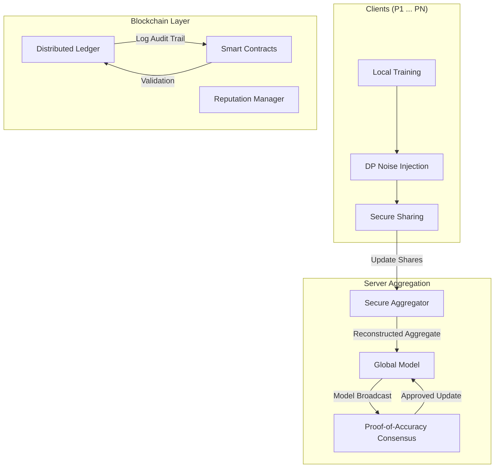

# Project Architecture

This document describes the high-level architecture of the **Secure Federated Learning** system.

## Overview

The system is designed as a decentralized research platform that combines **Federated Learning (FL)** with **Blockchain** technology to ensure data privacy, model integrity, and participant accountability.

## Core Components

### 1. Federated Learning Lifecycle
*   **Initialization**: The global server initializes a base model (e.g., Simple MLP for MNIST) and broadcasts it to all participants.
*   **Local Training**: Each client trains the model on its private dataset.
*   **Privacy Guard**: Before submission, updates are processed via **Differential Privacy (DP)** to prevent information leakage.
*   **Aggregation**: The server collects updates and computes a new global model using robust strategies (e.g., Median or Trimmed Mean).

### 2. Blockchain Integration
*   **Immutable Ledger**: Every model update, transaction, and validation result is recorded on an in-memory blockchain.
*   **Consensus (Proof-of-Work)**: Mining ensures the integrity of the chain and prevents tampering.
*   **Smart Contracts**:
    *   **Validation Contract**: Checks updates for anomalies (L2-norm clipping, cosine similarity against the median).
    *   **Aggregation Contract**: Manages the secure collection of shares.

### 3. Reputation & Security
*   **Reputation System**: Participants start with a base score. Valid updates earn rewards, while malicious or low-quality updates are penalized.
*   **Blacklisting**: Clients whose reputation falls below a threshold are blocked from participating in future rounds.
*   **Consensus (Proof-of-Accuracy)**: A supermajority of "validator" nodes must vote to accept a global update based on their own local performance validation.

## Dashboard Visualization

The `dashboard/index.html` file serves as a **standalone research visualizer**. It simulates the entire BCFL process (Blockchain Federated Learning) in the browser to demonstrate:
*   Real-time accuracy convergence.
*   Malicious node detection.
*   Ledger block generation.
*   Reputation leaderboard updates.

> [!NOTE]
> The dashboard is a client-side simulation (Mocked JS) and does not interact directly with the Python backend. It is intended for presentation and educational purposes.
