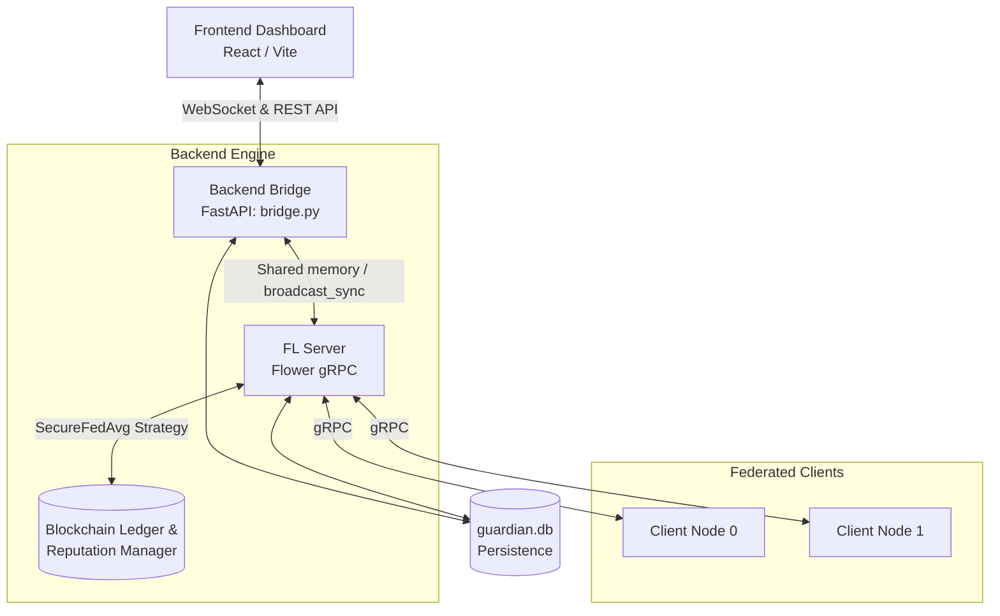

# Secure Federated Learning Workbench - Technical Architecture

This document outlines the system architecture, orchestration models, and component interactions of the Secure Federated Learning Workbench. It serves as a guide for the team to understand the current situation of the project and recent stability improvements.

## System Architecture

The project consists of a React/Vite frontend dashboard that communicates with a Python-based backend. The backend manages the Federated Learning (FL) server (using the Flower framework), orchestrates local client models, and integrates with a simulated blockchain ledger for security and reputation tracking.

## Core Components

1.  **Dashboard Bridge (`Cybronites/server/bridge.py`)**
    *   Acts as the central communication hub.
    *   Hosts a FastAPI server offering REST endpoints to trigger training and a WebSocket endpoint for real-time telemetry.
    *   Maintains a `ConnectionManager` singleton (`bridge`) to safely broadcast logs and statistics to connected UI clients.
    *   Manages the `start_federated_training` endpoint which, depending on the environment, spins up background threads for the training session.

2.  **FL Strategy (`Cybronites/server/strategy.py`)**
    *   Implements `SecureFedAvg`, extending Flower's default `FedAvg`.
    *   Validates incoming model updates using the `ValidationContract` (simulating smart contract logic).
    *   Computes and records client reputation scores.
    *   Uses `bridge.broadcast_sync()` to pipe real-time training metrics (loss, accuracy) and logs back to the dashboard.
    *   Persists node metrics directly to `guardian.db`.

3.  **Client Nodes (`Cybronites/client/client.py` & `model.py`)**
    *   Loads the standard dataset (MNIST).
    *   Trains models locally and applies Differential Privacy (DP) before sending weights to the server.
    *   Connects to the orchestrator via gRPC.

4.  **Security & Ledger (`blockchain/`)**
    *   `Blockchain`: A simulated ledger tracking historical model updates and metadata.
    *   `ReputationManager`: Tracks which clients provide valid updates versus malicious ones.
    *   `ValidationContract`: Audits model differences (L2 Norm, Cosine distance) and flags outliers.

## Orchestration Models: Local vs. Cloud (Hugging Face)

The project supports two main execution environments, optimized for their respective constraints:

### 1. Local Development (`run_local.py`)
**Architecture:** Subprocess Isolation Model

*   `run_local.py` is the orchestrator script.
*   It launches the FastAPI bridge, Flower Server, and two Client nodes as **separate OS processes** using `subprocess.Popen`.
*   This ensures true parallelism and CPU core isolation, offering the most stable development experience.
*   Log lines are streamed, and the WebSocket server is cleanly separated from heavy model computations.

### 2. Cloud Deployment (`deployment_hf/app.py`)
**Architecture:** Single-Process Threading Model

Hugging Face Spaces restricts applications to a single exposed port (7860) and often bounds multi-process capabilities.
*   `app.py` acts as the single entry point.
*   It auto-starts the Flower gRPC server and the simulated clients as **background threads** on boot.
*   The main thread then runs the FastAPI application via `uvicorn`.
*   **Crucial Patch:** Flower's `start_server` attempts to register signal handlers (`SIGINT`, `SIGTERM`), which crash when called from a background thread. `app.py` patches this by temporarily overriding python's `signal.signal` to a no-op right before `start_server` is invoked, restoring it immediately after.
*   By keeping all components in the same process, they can natively share the `bridge.py` singleton to achieve real-time dashboard updates without needing complex IPC (Inter-Process Communication) queues.

## Recent Stability Fixes & Caveats

*   **IPC Queue Removal**: Earlier attempts to use Python `multiprocessing` in the cloud introduced `log_queue` readers that occasionally became orphaned, causing a loop of `'NoneType' object has no attribute 'get'` errors. The current architecture strips this out in favor of simple, shared-memory thread orchestration.
*   **Database Synchronization**: Both local and cloud setups write directly to a shared `guardian.db` SQLite file. Because they execute node-checks and round-updates deterministically, this ensures persistent audit trails on Hugging Face (assuming a Persistent Storage block is requested on the Space dashboard).

## Extending the Workbench

When adding new features or telemetry:
1.  **Frontend**: Subscribe to events in `useSecureFederated.js`.
2.  **Backend Telemetry**: Use `bridge.broadcast_sync("LOG", payload)` or `bridge.broadcast_sync("STAT_UPDATE", dict)` from anywhere in the process space (in cloud mode) or locally via proper endpoints.
3.  **Models**: Edit `Cybronites/client/model.py`. The "Code Laboratory" UI provides a live interface to inject and test new model architectures.
