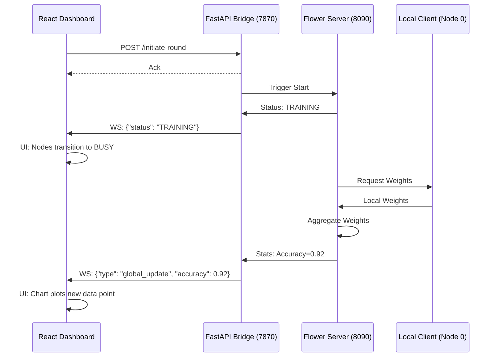

# AI Guardian Architectural Guide: Local Federated Orchestration

This document details the end-to-end synchronization between the **Secure Federated Learning Backend** (Python/Flower) and the **Institutional Dashboard** (React/Vite).

## 1. The Orchestration Layer (`run_local.py`)

The orchestration starts with `run_local.py`, which acts as the process coordinator. 

- **Environment Setup**: It initializes the `PYTHONPATH` to include the `Cybronites` directory and sets the `PORT` (7870) for the bridge.
- **Service Launch**:
    1.  **Bridge Server**: Launches the FastAPI server (`server.server`) as a background module.
    2.  **Federated Clients**: Launches multiple instances of `client.client` (e.g., Node 0 and Node 1).
- **Communication Bridge**: It ensures that both the server and clients are running in the same virtual environment (`venv_mac`) to resolve all dependencies.

---

## 2. The Backend Engine (`Cybronites/server`)

The backend consists of two primary services running within a single process:

### A. The Dashboard Bridge (`bridge.py`)
A **FastAPI** application that serves as the communication hub.
- **WebSocket (`/ws`)**: Maintains persistent links to all open dashboard tabs.
- **REST API**: Provides endpoints (`/initiate-round`, `/aggregate`) for the dashboard to trigger federated logic.
- **Thread-Safe Broadcast**: Contains the `ConnectionManager.broadcast_sync()` method, which allows the Flower server (running on a secondary thread) to safely push updates to the async WebSocket loop.

### B. The Flower Server (`server.py` & `strategy.py`)
The logic engine for federated aggregation.
- **Custom Strategy (`SecureFedAvg`)**: A tailored version of the FedAvg algorithm that includes hooks for real-time telemetry.
- **`configure_fit` Hook**: When a training round starts, it broadcasts `{"status": "TRAINING"}` to the bridge.
- **`aggregate_fit` Hook**: After weights are collected and aggregated, it calculates the new global accuracy and broadcasts `{"type": "global_update", "stats": {"accuracy": 0.85, ...}}`.
- **Blockchain Integration**: Each successful aggregation triggers a "Block" creation, which is also broadcasted to the dashboard.

---

## 3. The Frontend Integration (`dashboard/src`)

The frontend consumes the backend data through a reactive hook system.

### A. The Data Hook (`useSecureFederated.js`)
This is the "heart" of the dashboard's connectivity.
- **Handshake**: It establishes a WebSocket connection to `ws://localhost:7870/ws`.
- **State Mapping**: 
    - **`initial_state`**: When the socket opens, the bridge sends the current simulation state (last round, active nodes, blockchain history).
    - **`global_update`**: As the backend trains, this message updates the `accuracyHistory` array and the global `round` counter.
    - **`status_update`**: Real-time status shifts (IDLE -> TRAINING -> AGGREGATING) drive the animations and labels in the UI.

### B. Visual Mapping (Components)
How the backend data manifests in the UI:
- **`MetricsChart.jsx`**: Maps the `accuracyHistory` array to a Recharts AreaChart. It uses a `debounce` to ensure the "Accuracy Curve" renders smoothly even during high-frequency updates.
- **`ArchitectureBuilder.jsx` (Blueprint Live)**: Uses the `status` and `clients` state to toggle node indicators between **ACTIVE** (Connected) and **BUSY** (Currently Training).
- **`Terminal.jsx`**: Displays a rolling log of every broadcasted message, providing a raw "System Output Console" for debugging the backend in real-time.

---

## 4. Summary of Data Flow (The "Round" Lifecycle)

> [!TIP]
> All telemetry is asynchronous. Even if the user refreshes the page, the `initial_state` message from the bridge ensures the dashboard immediately "catches up" to the current federated progress without losing data points.
