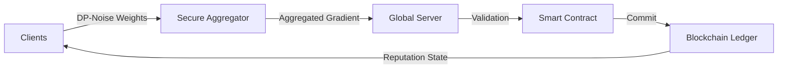

# 🛡️ Secure Federated Learning — Blockchain & SMPC

A premium, research-grade platform for **Blockchain-Based Secure Federated Learning (BCFL)**. This project implements a comprehensive decentralized ML framework that prioritizes **Privacy**, **Security**, and **Accountability**.

---

## 🚀 Key Features

*   **🔒 Privacy-Preserving Training**: Integrated **Local Differential Privacy (DP)** with L2-norm clipping and Gaussian noise injection.
*   **⛓️ Blockchain Distributed Ledger**: In-memory PoW blockchain providing an immutable audit trail for every model update and transaction.
*   **🧩 Secure Multi-Party Computation**: SMPC-based **Secure Aggregation** using Additive Secret Sharing to protect client updates from the central server.
*   **⚖️ Reputation & Governance**: Advanced scoring system that rewards honest participants and blacklists malicious actors based on smart contract validation.
*   **🛡️ Poisoning Defense**: Multi-stage verification (L2-norm metrics + Cosine Similarity) against model poisoning and Sybil attacks.
*   **📊 Interactive Dashboard**: A [standalone research visualizer](dashboard/index.html) built for high-level simulation and architectural demonstrations.

---

## 🛠️ Quick Start

### 1. Prerequisites
Ensure you have Python 3.9+ installed. This project uses `torch` for machine learning.

### 2. Installation
Clone the repository and install dependencies:
```bash
git clone https://github.com/ImBajrangi/FederatedLearningSystem.git
cd secure_federated_learning
pip install -r requirements.txt
```

### 3. Run the Simulation
Launch the full simulation demo to witness the decentralized training process:
```bash
python demo.py
```

---

## 🏗️ Architecture



For a deeper dive into the system design, please refer to the detailed documentation:

*   📘 **[Architecture Overview](docs/ARCHITECTURE.md)** — Lifecycle and component interactions.
*   🔐 **[Security Framework](docs/SECURITY.md)** — Deep dive into DP, SMPC, and defense mechanisms.
*   📖 **[API Reference](docs/API_REFERENCE.md)** — Documentation for core classes and methods.

---

## 🎨 Visualization Dashboard

The dashboard provides a visual layer to the complex underlying simulation. Open `dashboard/index.html` in any modern browser to see:
- Real-time convergence of global model accuracy.
- Live blockchain mining events and transaction logs.
- Client reputation leaderboard and status tracking.

---

## 📝 License
This project is licensed under the MIT License - see the [LICENSE](LICENSE) file for details.

---

> [!TIP]
> This system is designed for **Research and Prototyping**. For production deployments, we recommend integrating with a production-grade blockchain like Hyperledger Fabric or Ethereum for persistence.
